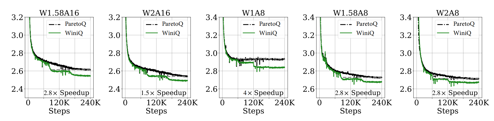
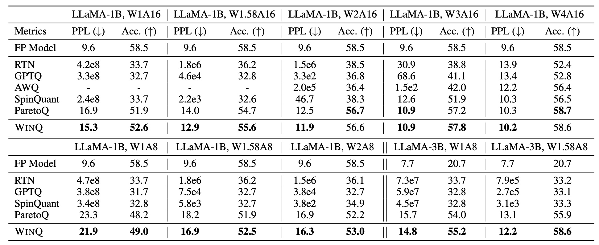

# WinQ

This repository contains the training code of WinQ introduced in our work: "[WinQ: Accelerating Quantization-Aware Training of LLMs around Saddle Points]"

## Overview

**WinQ** is a novel training acceleration method for Quantization-Aware Training (QAT) that addresses the fundamental convergence bottleneck in sub-4-bit language model quantization.

### The Problem

Quantization-aware training is widely used for sub-4-bit language model quantization, where full-precision weights are trained to minimize loss with gradients computed on the quantized model. Despite its superior performance, QAT suffers from **slow convergence** that becomes significantly worse at lower bit-widths. While this problem has been observed in prior work, its precise cause has not been carefully studied.

### Our Discovery

Through systematic analysis of the **Hessian spectrum** throughout QAT, we identified the root cause of slow convergence:

- **Flat Loss Surfaces**: Model weights converge to flat surfaces near saddle points
- **Eigenvalue Concentration**: A large fraction of Hessian eigenvalues concentrate around zero
- **Diminishing Gradients**: Both positive and negative eigenvalue magnitudes decrease over training
- **Bit-width Dependency**: Lower bit-widths exhibit significantly smaller Hessian eigenvalue magnitudes, correlating with slower convergence

### Our Solution

WinQ accelerates quantized training through two complementary techniques:

1. **Periodic Weight Re-initialization**: Linear interpolation between full-precision weights **W** and quantized weights **Q(W)** that:
   - Resets weights to regions with larger (magnitude) Hessian eigenvalues
   - Maintains low loss values throughout training
   - Provides stronger gradient signals for optimization

2. **Noise Injection Regularization**: Controlled noise perturbation that:
   - Regularizes the Hessian spectrum
   - Improves model robustness and generalization
   - Makes the method broadly applicable across quantization methods

### Key Results

- **4× Training Speedup**: Accelerates various quantized training methods by up to 4×
- **8.8% Quality Improvement**: Improves state-of-the-art sub-4-bit quantization performance by up to 8.8% relatively
- **Broad Applicability**: Consistently effective across 16 different settings of language models, quantization methods, and bit-widths

## Citation

If you find our code useful for your research, please consider citing:

    @article{winq2025,
      title={WinQ: Accelerating Quantization-Aware Training of LLMs around Saddle Points},
      author={Dongyue Li and Zechun Liu and Kai Yi and Changsheng Zhao and Raghuraman Krishnamoorthi and Harshit Khaitan and Hongyang R. Zhang and Steven Li},
      journal={arXiv preprint},
      year={2025}
    }

## Run

### 1. Requirements:
* python 3.11
* pip3 install torch
* pip install -r requirement.txt

### 2. Steps to run:
* Specify the data path and the pre-trained full-precision model path in run_train.sh file
* Run `bash scripts/1_run_train.sh $w_bit` E.g. `bash scripts/1_run_train.sh 2` for 2-bit weight quantization.

## Acknowledgement

This code is partially based on HuggingFace [Transformers](https://github.com/huggingface/transformers) repo under [Apache License](https://github.com/huggingface/transformers/blob/main/LICENSE).

## Contact

Kai Yi, Reality Labs, Meta Inc (kaiyi96 at meta dot com)

Steven Li, Reality Labs, Meta Inc (stevenlx at meta dot com)

## License

WinQ is released under the [BSD 3](https://github.com/facebookresearch/WinQ/blob/main/LICENSE) license.
